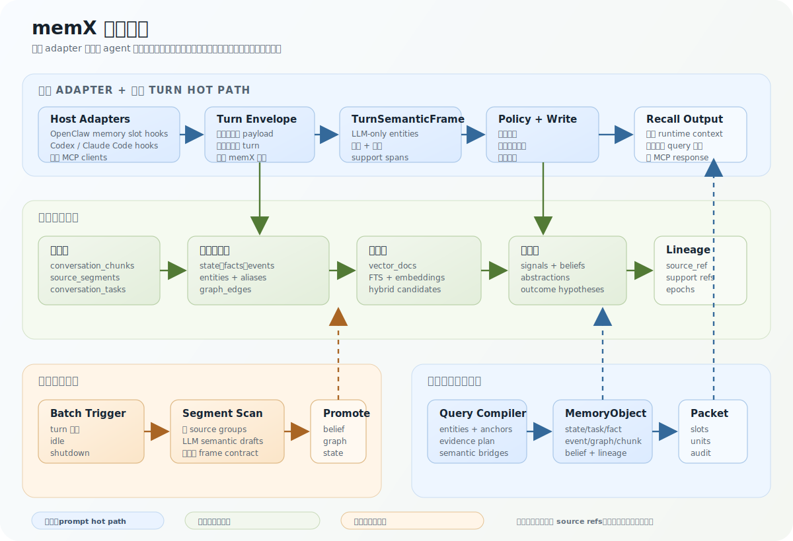

  

  <a href="./README-ch.md">README</a> · <a href="./ARCHITECTURE.md">English</a> ·
  <a href="./ARCHITECTURE-ch.md">中文</a>

# memX 架构深读

memX 的核心契约是：每一条可召回记忆都必须能回溯到 turn、source segment 或派生对象。写入、
维护、召回三条链路因此共用同一套 lineage，而不是各自维护一份无法解释来源的摘要。

## 运行时形态

memX 的运行时由宿主 adapter 层和共享记忆引擎组成。

对 OpenClaw，memX 接管 memory slot，并只依赖两个运行时 hook：

- `before_prompt_build`：agent 回答前执行召回。
- `agent_end`：agent 回答后捕获本轮 turn。

旧的 `memory_search` / `memory_get` 兼容工具默认关闭。memX 召回结果会作为 runtime context
注入，而不是显示成用户消息。注入指令也会告诉 agent：除非用户明确询问这些文件，否则不要把工作区
`MEMORY.md` / `memory/*.md` 当作当前活动记忆后端。

对 Codex 和 Claude Code，memX 提供原生 plugin manifest 和宿主 hook。这些 hook 会把宿主 payload
归一化成 `MemxTurnEnvelope`：包含 `hostId`、`actorId`、`sessionId`、`workspaceDir`、`eventName`
以及规范化后的 user/assistant/tool 消息，然后发给本地 memX service。service 统一持有 DB、
embedding worker、turn scheduler 和 maintenance loop，因此 hook 自身不会启动独立记忆 worker。
由于 hooks 已经接管自动召回和 turn 捕获，native MCP 工具面默认是 `lifecycle-safe`：只暴露
`memx_stats`、`memx_audit` 和 `memx_forget`。如果明确需要，也可以通过 `--mcp-tools full`
恢复召回/写入工具，但它们不是默认 native 生命周期路径的一部分。

对其它 agent，memX 通过 MCP 工具暴露同一套记忆引擎。MCP-only agent 可以调用 `memx_recall`、
`memx_remember`、`memx_observe`、`memx_forget`、`memx_stats` 和 `memx_audit`。这条路径有意比
OpenClaw adapter 更薄：它优先保证广泛兼容，而不是假设每个宿主都有精确的 prompt 注入 hook。

## 记忆对象设计

memX 的存储分三层。

### 1. 证据层

这一层保留 turn 原文证据，在做持久判断前不急着总结掉信息。

- `conversation_chunks`：保存当前 turn 的 user、assistant、tool 消息，包含 `turn_id`、
  `session_key`、角色、去重状态、任务归属和 `source_ref`。
- `source_segments`：把超长 user 或 assistant 内容切成可索引片段。hot path 可以只处理轻量 turn
  frame，同时 maintenance 仍能看到完整长输入。
- `conversation_tasks`：维护任务连续性、状态、阶段和近期摘要。

这层是保守层：它既可以被直接召回，也给结构化记忆提供来源证据。

### 2. 规范记忆层

这一层保存可评分、可 supersede、可查询的结构化对象，避免每次召回都重新解析 transcript。

- `state_kv`：保存当前状态或持久状态，例如活动任务、阻塞点、偏好、工作上下文。
- `facts`：保存稳定断言，包含 subject、predicate、object、状态、有效期、来源引用和版本历史。
- `episodic_events`：保存带时间的观察、动作和结果。
- `entities` / `entity_aliases`：保存实体规范名和别名。
- `graph_edges`：用 `depends_on`、`uses`、`blocks`、`supersedes`、`resolved_by` 等关系连接实体、
  任务、状态、事实、事件和结果。
- `vector_docs` / `vector_embeddings`：把规范对象和证据片段暴露给 FTS/BM25、多语种 CJK-family
  lexical matching、embedding 和 hybrid 召回。

### 3. 学习层

这一层判断一条记忆应该更稳定、更少出现，还是被提升为更高层模式。

- `memory_signal_events`：记录 repeated use、contradiction、correction、retrieval support、
  stale decay、outcome feedback、promotion、demotion 等信号。
- `memory_beliefs`：记录 posterior confidence、usefulness、stability、contradiction risk、
  use count 和 lifecycle stage。
- `abstraction_candidates`：保存 derived state、workflow pattern、concept candidate、graph
  hypothesis 和 outcome hypothesis。
- `retrieval_audit`：记录最终选中的证据和注入 prompt 的大小，便于审计。

### Recall Object 包装

召回时，上述行会被投影成 `MemoryObject`：

- `kind`：`state`、`task`、`fact`、`event`、`graph_path`、`chunk` 或 `alternate`；
- `row`：可展示的证据文本、source ref 和分数；
- `attributes`：active task、entity count、fact predicate、temporal role、source kind 等结构化提示；
- `profile`：workflow、factual、temporal、explanatory、relation、continuity、recency、
  stability、guidance 等路线分数；
- 可选 `belief`、graph path 信息和 lineage。

这层包装让 recall 可以用同一个调度器比较不同类型对象，同时保留原始 typed storage。

## 写入链路

写入链路在一个 turn 完成后开始。

1. **Turn Capture**
   memX 从 `agent_end` 读取显式的当前 turn payload。它会排除 memX 注入上下文、system scaffolding、
   陈旧历史和 heartbeat/control turn，得到只属于当前 turn 的 user/assistant/tool 内容。

2. **证据持久化**
   消息写入 `conversation_chunks`。长消息额外写入 `source_segments`，保证中段和尾段语义不会因为
   hot path 压缩而丢失。这些 segment 会被索引，并留给维护链路二次处理。

3. **LLM Semantic Compilation**
   turn compiler 产出一个 `TurnSemanticFrame`，包含：

   - `sourceRefs`
   - `chunkDrafts`
   - 可选 `taskProposal`
   - `assertionDrafts`
   - `correctionDrafts`
   - `relationDrafts`
   - `resourceAssertions`
   - `adviceSignals`
   - `supportSpans`
   - `compilerProvenance`

   这是实体和关系语义抽取的唯一实现路径。deterministic 代码仍然可以做 normalize、score、dedupe
   和 route，但不会自己生成语义实体或关系事实。

4. **Policy and Materialization**
   draft 被包成带 structured hints 的 `MemoryCandidate`。classifier 和 policy 决定它应当成为
   session state、durable state、stable fact、episodic event、graph relation，还是只保留为
   ignored evidence。write 层随后物化对象，并更新 vector docs。

5. **Assistant Output Rule**
   assistant 输出不会整段复制进记忆。只有当 LLM 明确抽出可复用建议、结论、资源关系、纠错或任务状态，
   并带有支撑 span 时，assistant 内容才会成为持久记忆。

## 维护链路

维护链路是慢速语义路径。它会在累计足够 turn、空闲一段时间或 runtime shutdown 时运行。

1. **Batch Selection**
   batch 会记录 turn ids、session key、触发原因和上下水位，避免同一段来源区间被含混地重复处理。

2. **Long Source Segment Scan**
   对长 turn，维护链路读取已持久化的 `source_segments`，让 LLM 对每个 source group 生成语义 draft，
   再把结果 reduce 回与 hot write path 相同的 `TurnSemanticFrame`。

3. **Signal and Belief Updates**
   signal ledger 记录 repeated evidence、contradiction、correction、retrieval support、outcome
   feedback、promotion、demotion 和 stale decay。belief 根据这些信号在 candidate、probationary、
   active、decaying、superseded、quarantined 之间迁移。

4. **Consolidation and Promotion**
   维护链路可以 supersede 旧事实、衰减过期任务状态、把重复模式提升成 abstraction、构造 graph/outcome
   hypothesis，并让高层总结继续指向原始 source refs。

关键点是：维护链路不会发明第二套对象模型。它升级的仍然是召回已经能消费的 chunk、task、fact、state、
event、graph edge、belief 和 abstraction。

## 召回链路

召回在 prompt 构建前运行。

1. **Query Compiler**
   query compiler 先把当前 user query 压缩成有界 envelope，然后让 LLM 产出 retrieval contract：

   - `focusedQuery`
   - `queryEntities`
   - `anchors`
   - `queryShape`
   - route weights
   - `candidateSurfaces`
   - `evidenceGoals`
   - `evidencePlan` slots
   - 可选 `semanticBridges`

   超长 query 会被 compact，而不是机械截断。hook hot path 不会再跑第二次长文本 scan。

2. **Candidate Generation**
   memX 从 state、task、fact、event、chunk、graph path、entity alias、abstraction、belief 和
   vector search 收集候选。hybrid retrieval 结合 lexical/BM25、embedding 和结构化评分。lexical
   index 使用 Unicode script-aware word segmentation，并对 Han/kana/Hangul 做有界 subword expansion，
   让中、日、韩短 query 在 embedding 冷启动或不可用时也能匹配更长的记忆文本。

3. **Entity and Graph Matching**
   query entity hints 会匹配 canonical entities、aliases、profile vectors、cooccurrence 和 graph
   neighborhoods。随后 graph path 把实体连接到任务、资源、阻塞点、结果和历史决策。

4. **Evidence Packets**
   evidence assembler 用 answer evidence、context evidence、user resources、prior advice 和 support
   refs 填充 query slots。它会应用 hard exclusions、soft penalties、source expansion、重复隐藏和
   route-aware budgets。

5. **Prompt Injection**
   最终证据被渲染成紧凑的 memX context block，放在当前 effective query 上方。TUI/gateway 会话中，
   它以隐藏 runtime context 记录，便于审计，但不会显示成用户文本。

## 三条链路如何契合

三条链路保持一致，是因为它们共用同一组契约。

- 写入产出 `source_ref`、entity hints、relation drafts、support spans 和物化规范对象。
- 维护消费同一批 source refs 和 source segments，再把更强证据与 lifecycle metadata 写回同一批对象族。
- 召回通过 `MemoryObject`、`EvidenceUnit` 和 `EvidencePacket` 消费原始证据和提升后的对象。
- Query compiler 产出的 surfaces 正好对应写入和维护会生产的对象：state、fact、event、task、chunk、
  graph、entity alias、abstraction、belief、strategy 和 snippet。
- Retrieval audit 把最终 prompt lines 绑定回 packet ids 和 source refs，因此可以解释为什么一条记忆被注入。

这就是 memX 的核心设计：一套语义抽取契约、一套 typed memory store、一套贯穿写入、维护和 prompt
注入的 recall packet 契约。
