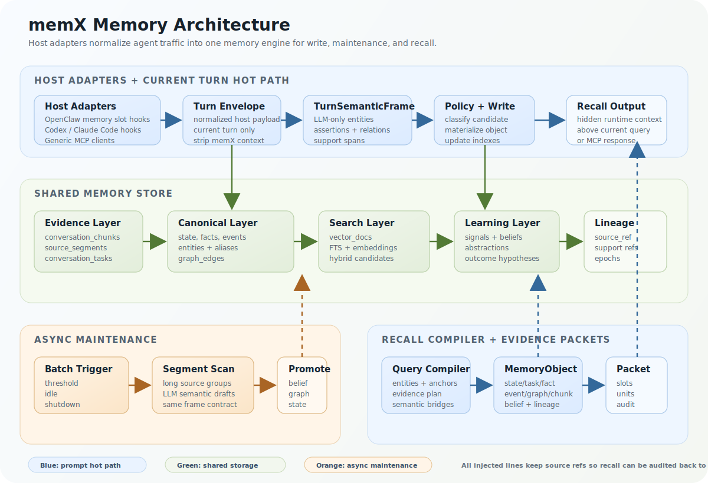

  

  <a href="./README.md">README</a> · <a href="./ARCHITECTURE.md">English</a> ·
  <a href="./ARCHITECTURE-ch.md">中文</a>

# MemX Architecture Deep Dive

MemX is built around one contract: every memory that can be recalled must be traceable back to a
turn, source segment, or derived object. The write, maintenance, and recall paths therefore share
the same lineage model instead of keeping separate summaries that cannot explain where they came
from.

## Runtime Shape

MemX has a shared memory engine plus host adapters.

For OpenClaw, MemX owns the memory slot and uses two runtime hooks:

- `before_prompt_build` runs recall before the agent answers.
- `agent_end` captures the completed turn after the agent answers.

The legacy `memory_search` / `memory_get` compatibility tools stay disabled by default. MemX recall
is injected as runtime context, not as a visible user message, and the injected instructions tell the
agent not to treat workspace `MEMORY.md` / `memory/*.md` as the active memory backend unless the
user explicitly asks about those files.

For Codex and Claude Code, MemX ships native plugin manifests and host hooks. Those hooks normalize
host payloads into a `MemxTurnEnvelope` with `hostId`, `actorId`, `sessionId`, `workspaceDir`,
`eventName`, and normalized user/assistant/tool messages, then post the envelope to the local MemX
service. The service owns the DB, embedding worker, turn scheduler, and maintenance loop, so hooks
do not start their own memory workers.

For all other agents, MemX exposes the same memory engine through MCP tools. MCP-only agents can
call `memx_recall`, `memx_remember`, `memx_observe`, `memx_forget`, `memx_stats`, and
`memx_audit`. This is intentionally thinner than the OpenClaw adapter: it gives broad compatibility
without pretending every host has a precise prompt-injection hook.

## Memory Object Design

MemX stores memory in three layers.

### 1. Evidence Layer

This layer preserves the turn before any durable conclusion is made.

- `conversation_chunks` store turn-scoped user, assistant, and tool messages with `turn_id`,
  `session_key`, role, dedupe status, task assignment, and `source_ref`.
- `source_segments` split long user or assistant content into indexed text segments. The hot path can
  keep the turn frame compact while the maintenance path still sees the full long input.
- `conversation_tasks` keep task continuity, status, phase, and recent summary.

This layer is intentionally conservative. It can be recalled directly as evidence, but it is also the
source material for structured memory.

### 2. Canonical Memory Layer

This layer stores structured objects that can be scored, superseded, and queried without reparsing
the transcript every time.

- `state_kv` stores current or durable state, such as active tasks, blockers, preferences, or
  working context.
- `facts` store stable assertions with subject, predicate, object, status, validity range, source
  reference, and version history.
- `episodic_events` store time-bound observations and outcomes.
- `entities` and `entity_aliases` keep canonical objects and names.
- `graph_edges` connect entities, tasks, states, facts, events, and outcomes through relations such
  as `depends_on`, `uses`, `blocks`, `supersedes`, and `resolved_by`.
- `vector_docs` and `vector_embeddings` expose canonical objects and evidence segments to FTS/BM25,
  multilingual CJK-family lexical matching, embedding, and hybrid retrieval.

### 3. Learning Layer

This layer decides whether memory should become more stable, less visible, or more abstract.

- `memory_signal_events` record signals such as repeated use, contradictions, correction,
  retrieval support, stale decay, and outcome feedback.
- `memory_beliefs` track posterior confidence, usefulness, stability, contradiction risk, use count,
  and lifecycle stage.
- `abstraction_candidates` hold derived states, workflow patterns, concept candidates, graph
  hypotheses, and outcome hypotheses.
- `retrieval_audit` records selected evidence and injected prompt size for inspection.

### Recall Object Wrapper

At recall time, these rows are projected into `MemoryObject` records. A `MemoryObject` has:

- `kind`: `state`, `task`, `fact`, `event`, `graph_path`, `chunk`, or `alternate`;
- `row`: displayable evidence text plus source reference and score;
- `attributes`: structured hints like active task, entity count, fact predicate, temporal role, or
  source kind;
- `profile`: route scores for workflow, factual, temporal, explanatory, relation, continuity,
  recency, stability, and guidance use;
- optional `belief`, graph path data, and lineage.

This wrapper lets recall rank very different objects with one scheduler while preserving their
original typed storage.

## Write Path

The write path starts after a turn completes.

1. **Turn Capture**
   MemX reads the explicit current-turn payload from `agent_end`. It excludes MemX injected context,
   system scaffolding, stale history, and heartbeat/control turns. The result is a turn-scoped
   user/assistant/tool payload.

2. **Evidence Persistence**
   Messages become `conversation_chunks`. Long messages also become `source_segments` so no middle or
   tail content is lost. These segments are indexed and remain available to the maintenance path.

3. **LLM Semantic Compilation**
   The turn compiler creates a `TurnSemanticFrame` with:

   - `sourceRefs`
   - `chunkDrafts`
   - optional `taskProposal`
   - `assertionDrafts`
   - `correctionDrafts`
   - `relationDrafts`
   - `resourceAssertions`
   - `adviceSignals`
   - `supportSpans`
   - `compilerProvenance`

   This is the only semantic extraction path for entities and relations. Deterministic code may still
   normalize, score, dedupe, and route objects, but it does not create semantic entity or relation
   facts on its own.

4. **Policy and Materialization**
   Drafts become `MemoryCandidate` records with structured hints. The classifier and policy choose
   whether each candidate becomes session state, durable state, stable fact, episodic event, graph
   relation, or ignored evidence. The write layer materializes the selected objects and updates vector
   docs.

5. **Assistant Output Rule**
   Assistant text is not copied wholesale into memory. It becomes durable memory only when the LLM
   extracts reusable advice, a conclusion, a resource relation, a correction, or task state with
   support spans.

## Maintenance Path

Maintenance is the slow semantic path. It runs after enough turns, after idle time, or during runtime
shutdown.

1. **Batch Selection**
   The batch records turn ids, session key, trigger reason, and lower/upper watermarks. This prevents
   the same source interval from being processed ambiguously.

2. **Long Source Segment Scan**
   For long turns, maintenance reads persisted `source_segments` and asks the LLM to produce semantic
   drafts for each source group. Those drafts are reduced back into the same `TurnSemanticFrame`
   structure used by the hot write path.

3. **Signal and Belief Updates**
   The signal ledger records repeated evidence, contradiction, correction, retrieval support, outcome
   feedback, promotion, demotion, and stale decay. Beliefs use those signals to move objects through
   candidate, probationary, active, decaying, superseded, or quarantined stages.

4. **Consolidation and Promotion**
   Maintenance can supersede old facts, decay obsolete task state, promote repeated patterns into
   abstractions, build graph and outcome hypotheses, and keep high-level summaries tied to raw source
   refs.

The important point is that maintenance does not invent a second object model. It upgrades the same
chunks, tasks, facts, states, events, graph edges, beliefs, and abstractions that recall already
knows how to use.

## Recall Path

Recall runs before prompt construction.

1. **Query Compiler**
   The query compiler compacts the current user query into a bounded envelope, then asks the LLM for
   a retrieval contract:

   - `focusedQuery`
   - `queryEntities`
   - `anchors`
   - `queryShape`
   - route weights
   - `candidateSurfaces`
   - `evidenceGoals`
   - `evidencePlan` slots
   - optional `semanticBridges`

   Long queries are compacted, not blindly truncated. The hook does not run a second long-text scan
   in the hot path.

2. **Candidate Generation**
   MemX gathers candidates from states, tasks, facts, events, chunks, graph paths, entity aliases,
   abstractions, beliefs, and vector search. Hybrid retrieval combines lexical/BM25, embedding, and
   structured scoring. The lexical index uses Unicode script-aware word segmentation plus bounded
   Han/kana/Hangul subword expansion, so short Chinese, Japanese, and Korean queries can still match
   longer memory text when embeddings are cold or unavailable.

3. **Entity and Graph Matching**
   Query entity hints are matched against canonical entities, aliases, profile vectors, cooccurrence,
   and graph neighborhoods. Graph paths then connect entities to tasks, resources, blockers,
   outcomes, and prior decisions.

4. **Evidence Packets**
   The evidence assembler fills query slots with answer evidence, context evidence, user resources,
   prior advice, and support refs. It applies hard exclusions, soft penalties, source expansion,
   duplicate hiding, and route-aware budgets.

5. **Prompt Injection**
   The selected evidence is rendered into a compact MemX context block above the effective current
   query. In TUI/gateway sessions it is stored as hidden runtime context for audit instead of being
   shown as user text.

## How the Three Paths Fit Together

The three paths stay consistent because they share the same contracts.

- Write produces `source_ref`, entity hints, relation drafts, support spans, and materialized
  canonical objects.
- Maintenance consumes the same source refs and source segments, then writes back the same object
  families with stronger evidence and lifecycle metadata.
- Recall consumes both raw evidence and promoted objects through `MemoryObject`, `EvidenceUnit`, and
  `EvidencePacket` wrappers.
- Query compiler output names the surfaces that write and maintenance actually produce: state, fact,
  event, task, chunk, graph, entity alias, abstraction, belief, strategy, and snippet.
- Retrieval audit ties the final prompt lines back to packet ids and source refs, so the system can
  explain why a memory was injected.

That is the core design: one semantic extraction contract, one typed memory store, and one recall
packet contract spanning write, maintenance, and prompt injection.
