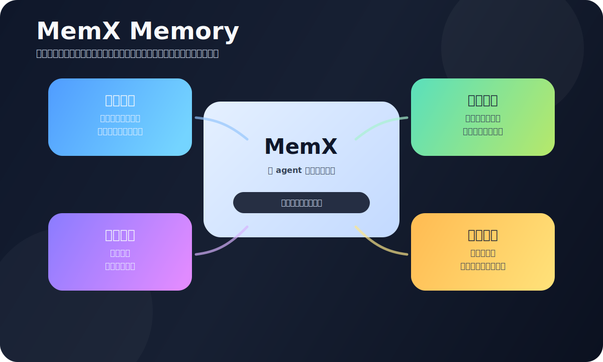

<p align="center">
  
</p>

<h1 align="center">MemX Memory for OpenClaw</h1>

<p align="center">
  <strong>包含自学习、自维护和关系图记忆能力的 OpenClaw 长期记忆插件。</strong>
</p>

<p align="center">
  <a href="./README.md">English</a> · <a href="./README-ch.md">中文</a>
</p>

---

MemX 是一个面向 OpenClaw 的本地优先长期记忆插件。它面向真实 agent 长期工作：跨天推进
工程任务，记住项目变化，理解用户偏好，处理纠错，连接相关人物、项目、工具和文件。

**它增加的能力**：长期工作记忆、任务状态跟踪、关系召回、习惯学习、自动整理，以及紧凑的
证据注入。

## 它能做什么

### 长期记住工作上下文

MemX 会保留长对话里真正有用的信息：项目决策、用户偏好、任务状态、重要事件和原始证据。
超长输入和超长 agent 回复会被切成相互关联的片段，召回时既能找到精确片段，也能知道它来自
同一个原始回合。

---

### 连接相关的人、项目和工具

MemX 包含关系图记忆能力。它可以维护项目、仓库、工具、人物、资源、卡点和结果之间的关系。
当同一个对象被换了不同叫法时，MemX 可以在有证据支持的情况下把它们连到同一个对象上。

例如一个项目先叫 “Raven”，后来被叫作 “Raven API” 或 “auth repo”，MemX 可以保留这些叫法
之间的联系，而不是把它们拆成几份互不相干的记忆。

---

### 从协作中学习你的习惯

MemX 可以从多次工作中学到稳定模式。比如你更喜欢小步、可回滚的改动；某个项目改 UI 前总要
先核对 API；或者一类任务通常要先跑特定检查。

这些学习结果不会脱离来源。MemX 会保留支撑它们的原始证据，避免生成没有依据的空泛总结。

---

### 自动维护记忆的新旧关系

MemX 会持续整理记忆：

- 多次出现的信息可以变成稳定记忆；
- 用户纠正后，新信息可以替代旧信息；
- 已过期的任务状态不会长期压过当前状态；
- 高层总结仍能回到原始证据；
- OpenClaw heartbeat 这类后台控制消息不会污染记忆。

这样记忆不会慢慢变成一堆旧聊天记录，而是随着工作变化持续更新。

---

### 只召回当前需要的证据

MemX 不会把所有相关记忆都塞进 prompt。它会在事实、事件、任务状态、对话片段、关系、资源和
已学到的工作习惯里搜索，然后把当前问题最需要的证据整理成简短可读的几行。

agent 得到的是可以直接用来回答问题的证据，而不是杂乱的记忆堆。

## 测试信号

在当前内部长期工程记忆 replay 测试中，MemX 达到了 **100% expected memory evidence recall**：
预期证据能够被写入、召回，并进入 prompt 注入链路。

这是当前测试集上的效果信号，不代表对所有未来场景作绝对保证。

## 快速安装

依赖：OpenClaw、Node.js 22+、`git`。如果使用本地 embedding，还需要 Python 3。

安装插件：

```bash
git clone https://github.com/NeoLi00/openclaw-memx.git
cd openclaw-memx

openclaw plugins install .
openclaw plugins enable memory-memx
```

打开记忆功能：

```bash
openclaw config set plugins.entries.memory-memx.config.enabled true
openclaw config set plugins.entries.memory-memx.config.autoCapture true
openclaw config set plugins.entries.memory-memx.config.autoRecall true
openclaw config set plugins.entries.memory-memx.config.reflectionEnabled true
```

重启并检查：

```bash
openclaw gateway run --bind loopback --force

openclaw plugins list
openclaw plugins info memory-memx
openclaw plugins doctor
```

## 模型和 embedding 配置

MemX 可以复用 OpenClaw 已有的非订阅式 API provider。如果你已经配置好了 provider，只需要指定
MemX 使用哪个 provider/model：

```bash
openclaw config set plugins.entries.memory-memx.config.advanced.llmClassifierModel provider/model
```

Embedding 默认走本地 `sentence-transformers-local`。如果使用推荐的本地 embedding 配置：

```bash
python3 -m pip install --user sentence-transformers torch
openclaw config set plugins.entries.memory-memx.config.embedding.provider sentence-transformers-local
openclaw config set plugins.entries.memory-memx.config.embedding.model intfloat/multilingual-e5-small
openclaw config set plugins.entries.memory-memx.config.embedding.localDevice auto
```

### 推荐的成本质量平衡组合

下面不是唯一选择，只是推荐用于平衡成本、质量、多语言召回和本地优先：

| 层 | 推荐选择 | 原因 |
| --- | --- | --- |
| LLM compiler | DeepSeek V4 Flash 或你已有的 API provider | 成本低，语义规划质量足够做记忆编译 |
| Embedding | `intfloat/multilingual-e5-small` | 本地运行，多语言召回，不产生 embedding API 费用 |

DeepSeek 示例：

```bash
export DEEPSEEK_API_KEY="sk-your-deepseek-key"

openclaw config set models.providers.deepseek.api openai-completions
openclaw config set models.providers.deepseek.baseUrl https://api.deepseek.com
openclaw config set models.providers.deepseek.apiKey '${DEEPSEEK_API_KEY}'

openclaw config set agents.defaults.model.primary deepseek/deepseek-v4-flash
openclaw config set plugins.entries.memory-memx.config.advanced.llmClassifierModel deepseek/deepseek-v4-flash
```
