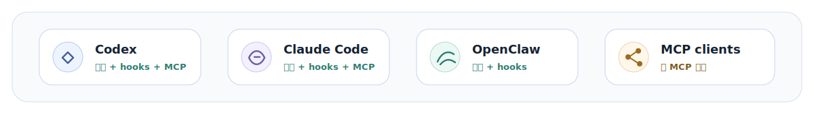

<p align="center">
  
</p>

<p align="center">
  <a href="./README.md">English</a> · <a href="./README-ch.md">中文</a> ·
  <a href="./ARCHITECTURE-ch.md">架构深读</a> ·
  <a href="mailto:neoliriven@gmail.com">联系</a>
</p>

---

MemX 把完成后的工作 turn 编译成结构化、可检索、可维护的长期记忆，并只把当前 query 需要的证据注入 prompt。
它原生适配 Codex、Claude Code、OpenClaw，也能通过同一层本地记忆接入任何支持 MCP 的 client。

## Benchmark

<table>
  <thead>
    <tr>
      <th>测试集</th>
      <th>范围</th>
      <th>R@3 成功率</th>
    </tr>
  </thead>
  <tbody>
    <tr>
      <td><strong>LongMemEval-S</strong></td>
      <td>长上下文记忆召回</td>
      <td><strong>94.2%</strong></td>
    </tr>
    <tr>
      <td><strong>中文工程 case</strong></td>
      <td>30 个中文 case，每个 20+ turns</td>
      <td><strong>100%</strong></td>
    </tr>
  </tbody>
</table>

## 架构

<p align="center">
  
</p>

## Agent 支持

<p align="center">
  
</p>

## 快速启动

依赖：Node.js 22.14+ 或 Node 24。OpenClaw 安装需要 OpenClaw 2026.3.25+。只有使用默认本地
embedding 运行时时才需要 Python 3。

README 命令默认使用 GitHub package spec。每次全新执行都会拉取 GitHub 当前代码，因此安装流程
不需要等待 npm publish。以后如果明确要用 npm 发布通道，再把 `github:NeoLi00/openclaw-memx`
换成 `@neoli00/memory-memx`。

### Claude Code

```bash
npx -y -p github:NeoLi00/openclaw-memx memx quickstart claude-code \
  --llm-provider openai-compatible \
  --llm-base-url https://llm.example.com/v1 \
  --llm-model fast-memory-model \
  --llm-api-key sk-your-provider-key
```

### Codex

```bash
npx -y -p github:NeoLi00/openclaw-memx memx quickstart codex \
  --llm-provider openai-compatible \
  --llm-base-url https://llm.example.com/v1 \
  --llm-model fast-memory-model \
  --llm-api-key sk-your-provider-key
```

### OpenClaw

```bash
npx -y -p github:NeoLi00/openclaw-memx memx quickstart openclaw \
  --preset custom \
  --provider-id my-provider \
  --base-url https://llm.example.com/v1 \
  --agent-model my-main-model \
  --memx-model my-fast-memory-model \
  --api-key sk-your-provider-key
```

### 通用 MCP

```bash
npx -y -p github:NeoLi00/openclaw-memx memx quickstart mcp \
  --llm-provider openai-compatible \
  --llm-base-url https://llm.example.com/v1 \
  --llm-model fast-memory-model \
  --llm-api-key sk-your-provider-key
```

Claude Code、Codex 和通用 MCP client 配置完成后，需要启动共享本地服务：

```bash
npx -y -p github:NeoLi00/openclaw-memx memx-server
```

默认 embedding：本地 `sentence-transformers-local`，模型 `intfloat/multilingual-e5-small`。
如果不想把 key 直接写进配置，用 `--llm-api-key-env PROVIDER_API_KEY`。使用 `--dry-run` 可以
只预览配置和 exec-form 命令。

## MemX 能做什么

- **长期记住工作上下文**：项目决策、用户偏好、任务状态、长 source segments 和原始证据都能
  保留来源关系。
- **连接相关对象**：项目、仓库、工具、文件、资源、卡点和结果可以形成实体与关系边。
- **学习协作模式**：重复出现的证据可以变成可复用建议，同时保留支撑来源。
- **自动维护记忆**：纠错可以替代旧事实，稳定证据可以提升，过期任务状态不会长期压过当前状态。
- **紧凑召回证据**：事实、事件、状态、片段、关系、资源和已学习模式一起参与召回，再压成小段
  evidence 注入。

本地开发且希望实时使用当前源码时，可以在克隆仓库内用 link 方式安装，避免复制到 OpenClaw 的
托管插件目录：

```bash
git clone https://github.com/NeoLi00/openclaw-memx.git
cd openclaw-memx
openclaw plugins install --link .
openclaw memx setup --local-embedding
openclaw gateway restart
openclaw memx doctor --deep
```

## 接入面

- **OpenClaw 原生 memory plugin**：接管 `plugins.slots.memory`，通过 `before_prompt_build`
  注入召回结果，通过 `agent_end` 捕获完成后的 turn。
- **Codex 和 Claude Code 原生插件资产**：`.codex-plugin/plugin.json` 与
  `.claude-plugin/plugin.json` 注册 MemX MCP server 和宿主生命周期 hooks。
- **通用 MCP**：其它支持 MCP 的 client 可以直接使用 `memx` MCP server。

## `memx setup` 会改什么

`memx quickstart openclaw` 会写入和 `openclaw memx setup` 相同的 MemX 插件设置，并额外写入
所选 OpenClaw LLM provider 和 `agents.defaults.model.primary`。

`openclaw memx setup` 是插件安装后的正常配置步骤。它会写入推荐的 OpenClaw 配置：

- 把 `memory-memx` 加进 `plugins.allow`；
- 把 `plugins.slots.memory` 设为 `memory-memx`，让 MemX 接管 OpenClaw 的 memory slot；
- 打开 `plugins.entries.memory-memx.hooks.allowPromptInjection`，让召回到的记忆作为运行时上下文
  注入到 agent 回答前；
- 启用 turn scheduler，以及召回、写入、维护链路使用的 LLM 语义编译路径；
- 保持 `advanced.enableCompatibilityMemoryTools=false`，因此 MemX 不会暴露兼容旧流程的
  `memory_search` / `memory_get` 工具，也不会把旧的 `MEMORY.md` / `memory/*.md` 召回提示和
  MemX 召回并行塞进 prompt；
- 根据命令参数选择 embedding provider/model；使用 `--local-embedding` 时会写入推荐的本地
  embedding 配置。

`memx setup` 不会删除或迁移已有的 `MEMORY.md`。MemX 注入的召回上下文也会要求 agent 不要把
`MEMORY.md` 或 `memory/*.md` 当作当前活动记忆后端，除非用户明确询问这些文件。如果你有旧的
`MEMORY.md` 笔记，应当有意识地迁移，而不是让两套记忆系统同时生效。

## 模型和 embedding 配置

### Standalone hosts

Codex、Claude Code 和通用 MCP 使用 MemX standalone config，不使用 `openclaw.json`。

quickstart 参数会直接写入 `~/.memx/config.json`：

- `--llm-provider`：`openai-compatible`、`anthropic`、`google` 或 `ollama`
- `--llm-base-url`：provider endpoint base URL
- `--llm-model`：MemX 语义 compiler 使用的模型
- `--llm-api-key` 或 `--llm-api-key-env`：provider API key
- `--embedding-provider`：`sentence-transformers-local`、`openai-compatible`、`ollama` 或 `off`
- `--embedding-model`：embedding 模型，默认 `intfloat/multilingual-e5-small`

`memx-server` 也支持这些运行时覆盖：`MEMX_CONFIG_PATH`、`MEMX_LLM_PROVIDER`、
`MEMX_LLM_BASE_URL`、`MEMX_LLM_MODEL`、`MEMX_LLM_API_KEY`、`MEMX_EMBEDDING_PROVIDER`、
`MEMX_EMBEDDING_MODEL`、`MEMX_EMBEDDING_BASE_URL`、`MEMX_EMBEDDING_API_KEY`、
`MEMX_EMBEDDING_OLLAMA_BASE_URL`、`MEMX_EMBEDDING_PYTHON`、`MEMX_EMBEDDING_CACHE_DIR` 和
`MEMX_EMBEDDING_DEVICE`。

### 复用已有 OpenClaw provider

MemX 可以复用 OpenClaw 已有的兼容 provider。如果你已经配置好了 provider，只需要指定
MemX 使用哪个 provider/model：

```bash
openclaw config set plugins.entries.memory-memx.config.advanced.llmClassifierModel provider/model
```

`openclaw memx setup --local-embedding` 会选择推荐的本地
`sentence-transformers-local` provider 和模型。你只需要给 OpenClaw 使用的 Python runtime 安装
依赖：

```bash
python3 -m pip install --user sentence-transformers torch
```

如果使用虚拟环境，在 setup 时传入对应的 Python：

```bash
openclaw memx setup --local-embedding --embedding-python /path/to/.venv/bin/python
openclaw gateway restart
```

### 自选 embedding provider

`openclaw memx setup --local-embedding` 只是推荐默认值。你可以用同一个 setup 命令选择其他
embedding provider，需要额外字段时再配合 `openclaw config set`。

本地 sentence-transformers，并自选模型：

```bash
python3 -m pip install --user sentence-transformers torch
openclaw memx setup \
  --embedding-provider sentence-transformers-local \
  --embedding-model BAAI/bge-m3 \
  --embedding-device auto
```

OpenAI-compatible embedding：

```bash
openclaw memx setup \
  --embedding-provider openai-compatible \
  --embedding-model text-embedding-3-small
openclaw config set plugins.entries.memory-memx.config.embedding.baseURL https://api.openai.com/v1
openclaw config set plugins.entries.memory-memx.config.embedding.apiKey "sk-your-embedding-key"
```

Ollama embedding：

```bash
openclaw memx setup \
  --embedding-provider ollama \
  --embedding-model nomic-embed-text
openclaw config set plugins.entries.memory-memx.config.embedding.ollamaBaseURL http://127.0.0.1:11434
```

关闭向量 embedding，只使用词法 fallback：

```bash
openclaw memx setup --embedding-provider off
```

修改 embedding 设置后，重启 Gateway。如果已经有历史记忆，重新索引一次，让向量库匹配新的
embedding provider：

```bash
openclaw gateway restart
openclaw memx reindex
```

### 推荐的成本质量平衡组合

下面不是唯一选择，只是推荐用于平衡成本、质量、多语言召回和本地优先：

| 层 | 推荐选择 | 原因 |
| --- | --- | --- |
| LLM compiler | 任意兼容的 OpenClaw LLM provider；给 `--memx-model` 选择一个快速、低成本模型 | 语义规划质量足够做记忆编译 |
| Embedding | `intfloat/multilingual-e5-small` | 本地运行，多语言召回，不产生 embedding API 费用 |
