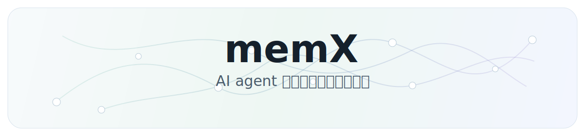
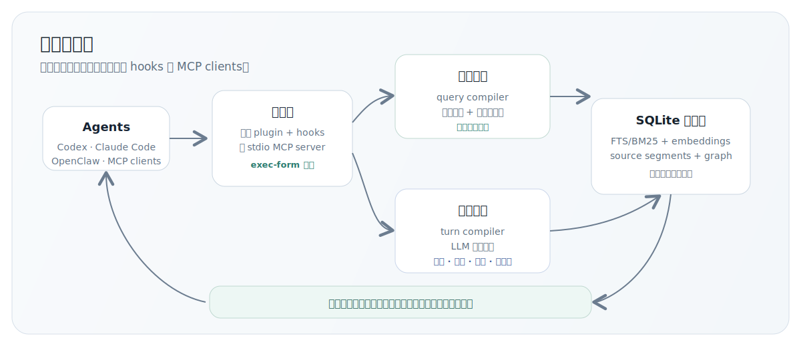

<p align="center">
  
</p>

<p align="center">
  <a href="./README.md">English</a> · <a href="./README-ch.md">中文</a> ·
  <a href="./ARCHITECTURE-ch.md">架构深读</a>
</p>

---

MemX 把完成后的工作 turn 编译成结构化、可检索、可维护的长期记忆，并只把当前 query 需要的证据注入 prompt。
它原生适配 Codex、Claude Code、OpenClaw，也能通过同一层本地记忆接入任何支持 MCP 的 client。

## Benchmark

<table>
  <thead>
    <tr>
      <th>测试集</th>
      <th>范围</th>
      <th>R@3 成功率</th>
    </tr>
  </thead>
  <tbody>
    <tr>
      <td><strong>LongMemEval-S</strong></td>
      <td>长上下文记忆召回</td>
      <td><strong>94.2%</strong></td>
    </tr>
    <tr>
      <td><strong>真实工程 case</strong></td>
      <td>30 个 case，每个 20+ turns</td>
      <td><strong>100%</strong></td>
    </tr>
  </tbody>
</table>

## 架构

<p align="center">
  
</p>

## Agent 支持

<table>
  <tr>
    <td align="center" width="25%">
      <br>
      <strong>Codex</strong><br>
      <sub>原生 + hooks + MCP</sub>
    </td>
    <td align="center" width="25%">
      <br>
      <strong>Claude Code</strong><br>
      <sub>原生 + hooks + MCP</sub>
    </td>
    <td align="center" width="25%">
      <br>
      <strong>OpenClaw</strong><br>
      <sub>原生 + hooks</sub>
    </td>
    <td align="center" width="25%">
      <strong>MCP</strong><br>
      <sub>任何兼容 MCP 的 client</sub>
    </td>
  </tr>
</table>

## 快速启动

依赖：Node.js 22.14+ 或 Node 24。OpenClaw 安装需要 OpenClaw 2026.3.25+。只有使用默认本地
embedding 运行时时才需要 Python 3。

README 命令默认使用 GitHub package spec。每次全新执行都会拉取 GitHub 当前代码，因此安装流程
不需要等待 npm publish。以后如果明确要用 npm 发布通道，再把 `github:NeoLi00/openclaw-memx`
换成 `@neoli00/memory-memx`。

先把下面这些值填好，再运行对应命令：

- `--llm-provider`：MemX 要调用的 LLM provider adapter。可选 `openai-compatible`、
  `anthropic`、`google` 或 `ollama`。
- `--llm-base-url`：provider 的 base URL。例如 `https://api.openai.com/v1`、
  `https://api.anthropic.com/v1`、`https://generativelanguage.googleapis.com/v1beta`，或者
  Ollama 的 `http://127.0.0.1:11434`。
- `--llm-model`：MemX 用来做记忆编译、召回规划和维护的模型。建议选速度快、成本低、JSON 输出
  稳定的模型。
- `--llm-api-key`：provider API key。如果不想写明文，用
  `--llm-api-key-env PROVIDER_API_KEY`，配置里会保存环境变量引用。本地 Ollama 可以不传 key。

默认 embedding 是本地 `sentence-transformers-local`，模型 `intfloat/multilingual-e5-small`。
只有想覆盖默认值时才需要额外传 `--embedding-provider` 和 `--embedding-model`。使用 `--dry-run`
可以先预览会写入哪些文件、会执行哪些 exec-form 命令。

### Claude Code

```bash
npx -y -p github:NeoLi00/openclaw-memx memx quickstart claude-code \
  --llm-provider openai-compatible \
  --llm-base-url https://llm.example.com/v1 \
  --llm-model fast-memory-model \
  --llm-api-key sk-your-provider-key
```

### Codex

```bash
npx -y -p github:NeoLi00/openclaw-memx memx quickstart codex \
  --llm-provider openai-compatible \
  --llm-base-url https://llm.example.com/v1 \
  --llm-model fast-memory-model \
  --llm-api-key sk-your-provider-key
```

### OpenClaw

```bash
npx -y -p github:NeoLi00/openclaw-memx memx quickstart openclaw \
  --llm-provider openai-compatible \
  --llm-base-url https://llm.example.com/v1 \
  --llm-model fast-memory-model \
  --llm-api-key sk-your-provider-key
```

### 通用 MCP

```bash
npx -y -p github:NeoLi00/openclaw-memx memx quickstart mcp \
  --llm-provider openai-compatible \
  --llm-base-url https://llm.example.com/v1 \
  --llm-model fast-memory-model \
  --llm-api-key sk-your-provider-key
```

Claude Code、Codex 和通用 MCP client 配置完成后，需要启动共享本地服务：

```bash
npx -y -p github:NeoLi00/openclaw-memx memx-server
```

## MemX 能做什么

- **长期记住工作上下文**：项目决策、用户偏好、任务状态、长 source segments 和原始证据都能
  保留来源关系。
- **连接相关对象**：项目、仓库、工具、文件、资源、卡点和结果可以形成实体与关系边。
- **学习协作模式**：重复出现的证据可以变成可复用建议，同时保留支撑来源。
- **自动维护记忆**：纠错可以替代旧事实，稳定证据可以提升，过期任务状态不会长期压过当前状态。
- **紧凑召回证据**：事实、事件、状态、片段、关系、资源和已学习模式一起参与召回，再压成小段
  evidence 注入。
