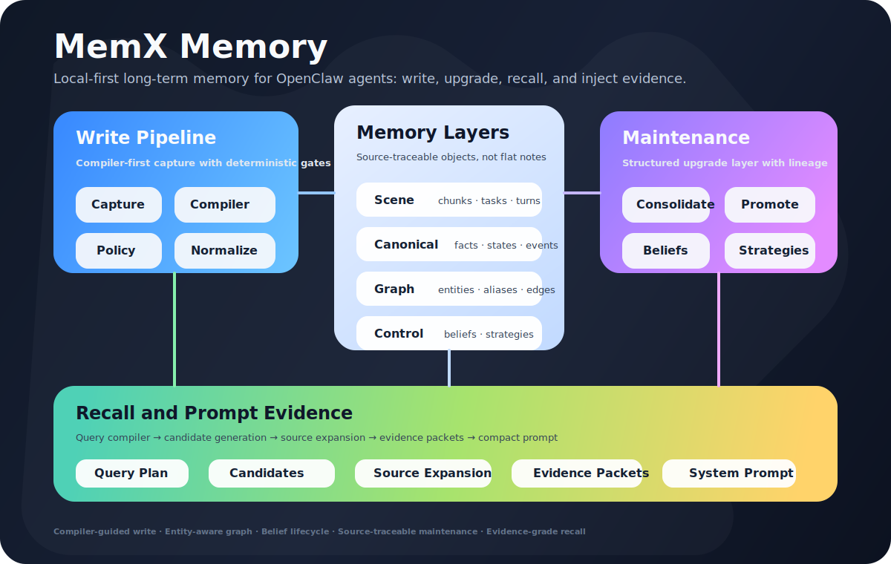

<p align="center">
  
</p>

<h1 align="center">MemX Memory for OpenClaw</h1>

<p align="center">
  <strong>Long-term agent memory with self-learning, self-maintenance, and relationship-aware recall.</strong>
</p>

<p align="center">
  Contact: <a href="mailto:neoliriven@gmail.com">neoliriven@gmail.com</a>
</p>

<p align="center">
  <a href="./README.md">English</a> · <a href="./README-ch.md">中文</a> ·
  <a href="./ARCHITECTURE.md">Architecture</a>
</p>

---

MemX is a local-first long-term memory plugin for OpenClaw. It helps agents keep working with you
across days, projects, decisions, corrections, and evolving preferences.

**What it adds:** stable work memory, task state, relationship recall, learned habits, automatic
cleanup, and compact evidence injection.

## What it can do

### Remember work over time

MemX keeps the useful parts of long conversations: project decisions, user preferences, task status,
important events, and raw evidence. Long inputs and long agent replies are split into linked segments
so precise slices can be recalled without losing the original turn.

---

### Connect related things

MemX includes relationship-aware memory. It can keep track of how projects, repos, tools, people,
resources, blockers, and outcomes relate to each other. When the same object is mentioned with
different names, MemX can use aliases and identity evidence to keep the memory connected.

Example: if a project is later called "Raven API", "the auth repo", or just "Raven", MemX can keep
those references tied together when the evidence supports it.

---

### Learn from repeated collaboration

MemX can notice stable patterns across repeated work. For example, it can learn that you prefer small
reversible patches, that a certain project needs API checks before UI work, or that a recurring task
usually follows the same review flow.

These learned patterns remain tied to supporting evidence. They are not loose summaries with no
source.

---

### Maintain itself

MemX continuously keeps memory usable:

- repeated evidence can become a stable memory;
- corrected information can replace older information;
- old task state can stop competing with current state;
- high-level summaries can point back to raw evidence;
- noisy control turns such as OpenClaw heartbeat checks are ignored.

The result is a memory store that evolves with the work instead of becoming a stale transcript.

---

### Recall useful evidence

When the agent needs memory, MemX does not dump everything into the prompt. It searches across
facts, events, state, chunks, relationships, resources, and learned patterns, then builds compact
evidence lines for the current question.

The agent sees what matters now, with enough source context to answer reliably.

## Evaluation signal

In the current internal long-running engineering-memory replay suite, MemX reached **100% recall of
the expected memory evidence**. That means the expected evidence was written, retrievable, and
available to prompt injection in the tested scenarios.

## OpenClaw quickstart

Requirements: OpenClaw 2026.3.25+ with Node.js 22.14+ or Node 24. Python 3 is required only
when you use local embeddings.

`memx quickstart openclaw` is OpenClaw-specific. It writes OpenClaw's config, installs the
OpenClaw memory plugin, assigns `plugins.slots.memory`, restarts the Gateway, and runs the MemX
doctor check. Codex, Claude Code, and generic MCP agents use the [multi-agent adapters](#multi-agent-adapters)
section instead.

The shortest DeepSeek example is:

```bash
npx -y -p @neoli00/memory-memx memx quickstart openclaw --api-key sk-your-deepseek-key
```

If you need the current GitHub `main` before a new npm package is published, use the same command
with the GitHub package spec:

```bash
npx -y -p github:NeoLi00/openclaw-memx memx quickstart openclaw --api-key sk-your-deepseek-key
```

This is only a provider example. MemX can use any OpenAI-compatible provider that OpenClaw can call.
For a generic provider, pass the provider endpoint and choose one main agent model plus one fast,
low-cost semantic compiler model:

```bash
npx -y -p @neoli00/memory-memx memx quickstart openclaw \
  --preset custom \
  --provider-id my-provider \
  --base-url https://llm.example.com/v1 \
  --agent-model my-main-model \
  --memx-model my-fast-model \
  --api-key sk-your-provider-key
```

The embedding defaults are:

- Embedding provider: `sentence-transformers-local`
- Embedding model: `intfloat/multilingual-e5-small`
- Local embedding Python: `~/.openclaw/memx/.venv/bin/python`

The quickstart creates the local embedding venv, installs `sentence-transformers` and `torch`,
installs the MemX plugin with `openclaw plugins install @neoli00/memory-memx`, writes the MemX
config, restarts the Gateway, and runs `openclaw memx doctor --deep`.

To avoid putting the API key directly in `~/.openclaw/openclaw.json`, store an env SecretRef
instead:

```bash
export DEEPSEEK_API_KEY="sk-your-deepseek-key"
npx -y -p @neoli00/memory-memx memx quickstart openclaw --api-key-env DEEPSEEK_API_KEY
```

Useful embedding overrides:

```bash
npx -y -p @neoli00/memory-memx memx quickstart openclaw \
  --api-key sk-your-deepseek-key \
  --embedding-model intfloat/multilingual-e5-small
```

Use `--dry-run` to preview the planned config and exec-form commands without writing files or
running installers. Use `--skip-embedding-deps` if you already installed the local embedding Python
dependencies.

For local development with live edits, link the cloned repository instead of copying it into
OpenClaw's managed plugin directory:

```bash
git clone https://github.com/NeoLi00/openclaw-memx.git
cd openclaw-memx
openclaw plugins install --link .
openclaw memx setup --local-embedding
openclaw gateway restart
openclaw memx doctor --deep
```

## Multi-agent adapters

MemX now ships three integration surfaces:

- **OpenClaw native memory plugin**: the existing `memory-memx` plugin owns
  `plugins.slots.memory`, injects recall through `before_prompt_build`, and captures completed
  turns through `agent_end`.
- **Codex and Claude Code native plugin assets**: `.codex-plugin/plugin.json` and
  `.claude-plugin/plugin.json` register the same MemX MCP server plus host lifecycle hooks.
- **Generic MCP**: any MCP-capable agent can use the `memx` MCP server without native hooks.

For Codex, Claude Code, or a generic MCP client, use the standalone quickstart. It writes MemX's
own config at `~/.memx/config.json`; OpenClaw config is not required.

```bash
npx -y -p @neoli00/memory-memx memx quickstart codex \
  --llm-provider openai-compatible \
  --llm-base-url https://llm.example.com/v1 \
  --llm-model fast-memory-model \
  --llm-api-key sk-your-provider-key
```

For Claude Code, change only the target:

```bash
npx -y -p @neoli00/memory-memx memx quickstart claude-code \
  --llm-provider openai-compatible \
  --llm-base-url https://llm.example.com/v1 \
  --llm-model fast-memory-model \
  --llm-api-key sk-your-provider-key
```

For an MCP-only client, generate the MemX config and print a generic MCP block:

```bash
npx -y -p @neoli00/memory-memx memx quickstart mcp \
  --llm-provider openai-compatible \
  --llm-base-url https://llm.example.com/v1 \
  --llm-model fast-memory-model \
  --llm-api-key sk-your-provider-key
```

All standalone quickstarts default to local embeddings:

- Embedding provider: `sentence-transformers-local`
- Embedding model: `intfloat/multilingual-e5-small`
- Python venv: `~/.memx/.venv/bin/python`

Use `--llm-api-key-env PROVIDER_API_KEY` instead of `--llm-api-key` if you want the config file to
reference an environment variable. Use `--embedding-provider`, `--embedding-model`,
`--embedding-base-url`, and `--embedding-api-key` when you want remote embeddings instead of the
local default.

Start the local service after configuration:

```bash
npx -y -p @neoli00/memory-memx memx-server
```

Codex and Claude Code native plugin hook capture still uses `MEMX_URL` (`http://localhost:3878` by
default). The bundled hook definitions use exec-form `command` plus `args`, not shell command
strings, so plugin installers do not need to evaluate shell tokenization.

OpenClaw users should prefer `memx quickstart openclaw` for first-time setup. Source checkouts can
still use `openclaw plugins install --link .` plus `openclaw memx setup` for local development.

## What `memx setup` changes

`memx quickstart openclaw` writes the same MemX plugin settings as `openclaw memx setup`, and also
writes the selected OpenClaw LLM provider plus `agents.defaults.model.primary`.

`openclaw memx setup` is the normal configuration step after the plugin is installed. It writes the
recommended OpenClaw config for MemX:

- adds `memory-memx` to `plugins.allow`;
- sets `plugins.slots.memory` to `memory-memx`, so the MemX plugin owns OpenClaw's memory slot;
- enables `plugins.entries.memory-memx.hooks.allowPromptInjection`, so recalled memory is injected
  as runtime context before the agent answers;
- enables the turn scheduler and the LLM semantic compiler path used for recall, write, and
  maintenance;
- keeps `advanced.enableCompatibilityMemoryTools=false`, so MemX does not expose the legacy
  `memory_search` / `memory_get` compatibility tools and does not add the old `MEMORY.md` /
  `memory/*.md` recall prompt next to MemX recall;
- selects the requested embedding provider and model, or the recommended local embedding setup when
  `--local-embedding` is used.

`memx setup` does not delete or migrate existing `MEMORY.md` files. MemX's injected recall context
also tells the agent not to treat `MEMORY.md` or `memory/*.md` as the active memory backend unless
the user explicitly asks about those files. If you have old curated notes in `MEMORY.md`, migrate
them deliberately instead of relying on both memory systems at the same time.

## Model and embedding setup

### Standalone hosts

Codex, Claude Code, and generic MCP use MemX's standalone config, not `openclaw.json`.

The quickstart fields map directly into `~/.memx/config.json`:

- `--llm-provider`: `openai-compatible`, `anthropic`, `google`, or `ollama`
- `--llm-base-url`: provider endpoint base URL
- `--llm-model`: model used by MemX semantic compilers
- `--llm-api-key` or `--llm-api-key-env`: provider API key
- `--embedding-provider`: `sentence-transformers-local`, `openai-compatible`, `ollama`, or `off`
- `--embedding-model`: embedding model; default is `intfloat/multilingual-e5-small`

`memx-server` also accepts `MEMX_CONFIG_PATH`, `MEMX_LLM_PROVIDER`, `MEMX_LLM_BASE_URL`,
`MEMX_LLM_MODEL`, `MEMX_LLM_API_KEY`, `MEMX_EMBEDDING_PROVIDER`, `MEMX_EMBEDDING_MODEL`,
`MEMX_EMBEDDING_BASE_URL`, `MEMX_EMBEDDING_API_KEY`, `MEMX_EMBEDDING_OLLAMA_BASE_URL`,
`MEMX_EMBEDDING_PYTHON`, `MEMX_EMBEDDING_CACHE_DIR`, and `MEMX_EMBEDDING_DEVICE` as runtime
overrides.

### Reuse an existing OpenClaw provider

MemX can reuse your existing OpenClaw provider. If OpenClaw already has a compatible provider
configured, you can simply point MemX at that provider/model:

```bash
openclaw config set plugins.entries.memory-memx.config.advanced.llmClassifierModel provider/model
```

For embeddings, `openclaw memx setup --local-embedding` selects the recommended local
`sentence-transformers-local` provider and model. Install the Python dependencies for the Python
runtime that OpenClaw will use:

```bash
python3 -m pip install --user sentence-transformers torch
```

If you use a virtual environment, pass its Python binary during setup:

```bash
openclaw memx setup --local-embedding --embedding-python /path/to/.venv/bin/python
openclaw gateway restart
```

### Choose an embedding provider

`openclaw memx setup --local-embedding` is only the recommended default. You can choose a different
embedding provider with the same setup command and, where needed, `openclaw config set`.

Local sentence-transformers with a custom model:

```bash
python3 -m pip install --user sentence-transformers torch
openclaw memx setup \
  --embedding-provider sentence-transformers-local \
  --embedding-model BAAI/bge-m3 \
  --embedding-device auto
```

OpenAI-compatible embeddings:

```bash
openclaw memx setup \
  --embedding-provider openai-compatible \
  --embedding-model text-embedding-3-small
openclaw config set plugins.entries.memory-memx.config.embedding.baseURL https://api.openai.com/v1
openclaw config set plugins.entries.memory-memx.config.embedding.apiKey "sk-your-embedding-key"
```

Ollama embeddings:

```bash
openclaw memx setup \
  --embedding-provider ollama \
  --embedding-model nomic-embed-text
openclaw config set plugins.entries.memory-memx.config.embedding.ollamaBaseURL http://127.0.0.1:11434
```

Disable vector embeddings and use lexical fallback only:

```bash
openclaw memx setup --embedding-provider off
```

After changing embedding settings, restart the Gateway. If you already have stored memories, reindex
them so the vector store matches the new embedding provider:

```bash
openclaw gateway restart
openclaw memx reindex
```

### Recommended cost-quality setup

The following combination is recommended for a practical balance of cost, quality, multilingual
retrieval, and local-first operation:

| Layer | Recommended choice | Why |
| --- | --- | --- |
| LLM compiler | Any compatible OpenClaw LLM provider; choose a fast, low-cost model for `--memx-model` | Semantic planning with enough quality for memory compilation |
| Embedding | `intfloat/multilingual-e5-small` | Fast local multilingual retrieval with no embedding API bill |
