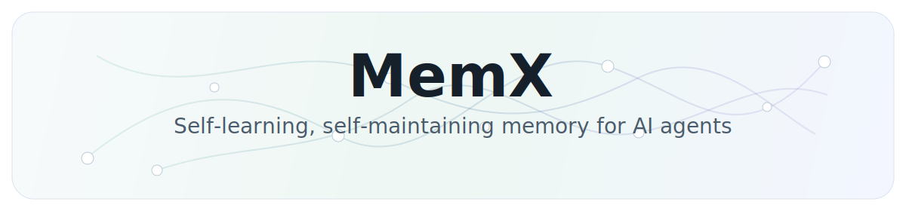
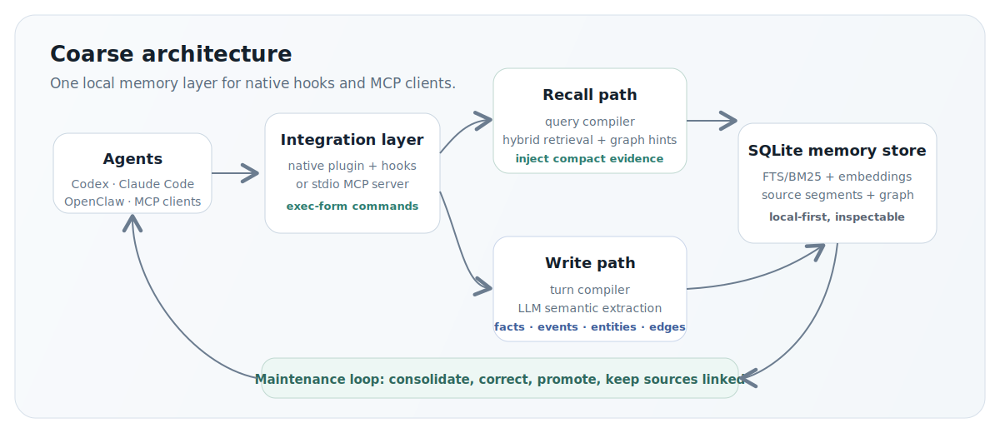
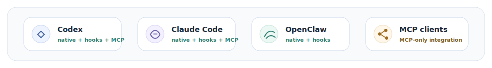

<p align="center">
  
</p>

<p align="center">
  <a href="./README.md">English</a> · <a href="./README-ch.md">中文</a> ·
  <a href="./ARCHITECTURE.md">Architecture</a>
</p>

---

MemX turns completed work into structured, searchable, self-maintained memory, then injects only the evidence an agent needs for the current query.
It connects natively to Codex, Claude Code, and OpenClaw, and reaches any MCP-compatible client through the same local memory layer.

## Benchmarks

<table>
  <thead>
    <tr>
      <th>Suite</th>
      <th>Scope</th>
      <th>R@3 success rate</th>
    </tr>
  </thead>
  <tbody>
    <tr>
      <td><strong>LongMemEval-S</strong></td>
      <td>Long-context memory retrieval</td>
      <td><strong>94.2%</strong></td>
    </tr>
    <tr>
      <td><strong>Real engineering cases</strong></td>
      <td>30 cases, each with 20+ turns</td>
      <td><strong>100%</strong></td>
    </tr>
  </tbody>
</table>

## Architecture

<p align="center">
  
</p>

## Agent support

<p align="center">
  
</p>

## Quick start

Requirements: Node.js 22.14+ or Node 24. OpenClaw installs require OpenClaw 2026.3.25+. Python 3 is
needed only for the default local embedding runtime.

The README commands use the GitHub package spec. A fresh run pulls current GitHub code, so installs
do not wait for an npm publish. To use the npm release channel later, replace
`github:NeoLi00/openclaw-memx` with `@neoli00/memory-memx`.

Fill in these values before running a command:

- `--llm-provider`: the provider adapter MemX should call. Choose one of `openai-compatible`,
  `anthropic`, `google`, or `ollama`.
- `--llm-base-url`: the base URL for that provider. Examples: `https://api.openai.com/v1`,
  `https://api.anthropic.com/v1`, `https://generativelanguage.googleapis.com/v1beta`, or
  `http://127.0.0.1:11434` for Ollama.
- `--llm-model`: the model MemX uses for memory compilation, recall planning, and maintenance.
  Pick a fast, low-cost model with reliable JSON output.
- `--llm-api-key`: the API key for the provider. Use `--llm-api-key-env PROVIDER_API_KEY` if you
  want the config to reference an environment variable instead of storing plaintext. For local
  Ollama, omit the key.

The default embedding setup is local `sentence-transformers-local` with
`intfloat/multilingual-e5-small`. Add `--embedding-provider` and `--embedding-model` only when you
want to override that default. Use `--dry-run` to preview the files and exec-form commands before
writing anything.

### Claude Code

```bash
npx -y -p github:NeoLi00/openclaw-memx memx quickstart claude-code \
  --llm-provider openai-compatible \
  --llm-base-url https://llm.example.com/v1 \
  --llm-model fast-memory-model \
  --llm-api-key sk-your-provider-key
```

### Codex

```bash
npx -y -p github:NeoLi00/openclaw-memx memx quickstart codex \
  --llm-provider openai-compatible \
  --llm-base-url https://llm.example.com/v1 \
  --llm-model fast-memory-model \
  --llm-api-key sk-your-provider-key
```

### OpenClaw

```bash
npx -y -p github:NeoLi00/openclaw-memx memx quickstart openclaw \
  --llm-provider openai-compatible \
  --llm-base-url https://llm.example.com/v1 \
  --llm-model fast-memory-model \
  --llm-api-key sk-your-provider-key
```

### Generic MCP

```bash
npx -y -p github:NeoLi00/openclaw-memx memx quickstart mcp \
  --llm-provider openai-compatible \
  --llm-base-url https://llm.example.com/v1 \
  --llm-model fast-memory-model \
  --llm-api-key sk-your-provider-key
```

For Claude Code, Codex, and generic MCP clients, start the shared local service after configuration:

```bash
npx -y -p github:NeoLi00/openclaw-memx memx-server
```

OpenClaw uses the same LLM flags as the standalone hosts. The quickstart path has no
provider-specific preset; use `--llm-provider openai-compatible` plus your provider's base URL for
OpenAI-compatible gateways and similar services. It configures MemX only and does not change
OpenClaw's primary agent model.

## What MemX can do

- **Remember work over time**: project decisions, user preferences, task status, long source
  segments, and raw evidence stay linked to the original turn.
- **Connect related things**: projects, repos, tools, files, resources, blockers, and outcomes can
  be represented as entities and graph edges.
- **Learn collaboration patterns**: repeated evidence can become reusable guidance without losing
  its supporting sources.
- **Maintain itself**: corrections can supersede older facts, stable evidence can be promoted, and
  stale task state stops competing with current state.
- **Recall compact evidence**: facts, events, state, chunks, relationships, resources, and learned
  patterns are searched together, then injected as small evidence lines.

For local development with live edits, link the cloned repository instead of copying it into
OpenClaw's managed plugin directory:

```bash
git clone https://github.com/NeoLi00/openclaw-memx.git
cd openclaw-memx
openclaw plugins install --link .
openclaw memx setup --local-embedding
openclaw gateway restart
openclaw memx doctor --deep
```

## Integration surfaces

- **OpenClaw native memory plugin**: owns `plugins.slots.memory`, injects recall through
  `before_prompt_build`, and captures completed turns through `agent_end`.
- **Codex and Claude Code native plugin assets**: `.codex-plugin/plugin.json` and
  `.claude-plugin/plugin.json` register the MemX MCP server plus host lifecycle hooks.
- **Generic MCP**: any MCP-capable client can use the `memx` MCP server without native hooks.

## What `memx setup` changes

`memx quickstart openclaw` writes the same MemX plugin settings as `openclaw memx setup`, and also
writes MemX's own LLM compiler provider settings. It does not write
`agents.defaults.model.primary`.

`openclaw memx setup` is the normal configuration step after the plugin is installed. It writes the
recommended OpenClaw config for MemX:

- adds `memory-memx` to `plugins.allow`;
- sets `plugins.slots.memory` to `memory-memx`, so the MemX plugin owns OpenClaw's memory slot;
- enables `plugins.entries.memory-memx.hooks.allowPromptInjection`, so recalled memory is injected
  as runtime context before the agent answers;
- enables the turn scheduler and the LLM semantic compiler path used for recall, write, and
  maintenance;
- keeps `advanced.enableCompatibilityMemoryTools=false`, so MemX does not expose the legacy
  `memory_search` / `memory_get` compatibility tools and does not add the old `MEMORY.md` /
  `memory/*.md` recall prompt next to MemX recall;
- selects the requested embedding provider and model, or the recommended local embedding setup when
  `--local-embedding` is used.

`memx setup` does not delete or migrate existing `MEMORY.md` files. MemX's injected recall context
also tells the agent not to treat `MEMORY.md` or `memory/*.md` as the active memory backend unless
the user explicitly asks about those files. If you have old curated notes in `MEMORY.md`, migrate
them deliberately instead of relying on both memory systems at the same time.

## Model and embedding setup

### Standalone hosts

Codex, Claude Code, and generic MCP use MemX's standalone config, not `openclaw.json`.

The quickstart fields map directly into `~/.memx/config.json`:

- `--llm-provider`: `openai-compatible`, `anthropic`, `google`, or `ollama`
- `--llm-base-url`: provider endpoint base URL
- `--llm-model`: model used by MemX semantic compilers
- `--llm-api-key` or `--llm-api-key-env`: provider API key
- `--embedding-provider`: `sentence-transformers-local`, `openai-compatible`, `ollama`, or `off`
- `--embedding-model`: embedding model; default is `intfloat/multilingual-e5-small`

`memx-server` also accepts `MEMX_CONFIG_PATH`, `MEMX_LLM_PROVIDER`, `MEMX_LLM_BASE_URL`,
`MEMX_LLM_MODEL`, `MEMX_LLM_API_KEY`, `MEMX_EMBEDDING_PROVIDER`, `MEMX_EMBEDDING_MODEL`,
`MEMX_EMBEDDING_BASE_URL`, `MEMX_EMBEDDING_API_KEY`, `MEMX_EMBEDDING_OLLAMA_BASE_URL`,
`MEMX_EMBEDDING_PYTHON`, `MEMX_EMBEDDING_CACHE_DIR`, and `MEMX_EMBEDDING_DEVICE` as runtime
overrides.

### Reuse an existing OpenClaw provider

MemX can reuse your existing OpenClaw provider. If OpenClaw already has a compatible provider
configured, you can simply point MemX at that provider/model:

```bash
openclaw config set plugins.entries.memory-memx.config.advanced.llmClassifierModel provider/model
```

For embeddings, `openclaw memx setup --local-embedding` selects the recommended local
`sentence-transformers-local` provider and model. Install the Python dependencies for the Python
runtime that OpenClaw will use:

```bash
python3 -m pip install --user sentence-transformers torch
```

If you use a virtual environment, pass its Python binary during setup:

```bash
openclaw memx setup --local-embedding --embedding-python /path/to/.venv/bin/python
openclaw gateway restart
```

### Choose an embedding provider

`openclaw memx setup --local-embedding` is only the recommended default. You can choose a different
embedding provider with the same setup command and, where needed, `openclaw config set`.

Local sentence-transformers with a custom model:

```bash
python3 -m pip install --user sentence-transformers torch
openclaw memx setup \
  --embedding-provider sentence-transformers-local \
  --embedding-model BAAI/bge-m3 \
  --embedding-device auto
```

OpenAI-compatible embeddings:

```bash
openclaw memx setup \
  --embedding-provider openai-compatible \
  --embedding-model text-embedding-3-small
openclaw config set plugins.entries.memory-memx.config.embedding.baseURL https://api.openai.com/v1
openclaw config set plugins.entries.memory-memx.config.embedding.apiKey "sk-your-embedding-key"
```

Ollama embeddings:

```bash
openclaw memx setup \
  --embedding-provider ollama \
  --embedding-model nomic-embed-text
openclaw config set plugins.entries.memory-memx.config.embedding.ollamaBaseURL http://127.0.0.1:11434
```

Disable vector embeddings and use lexical fallback only:

```bash
openclaw memx setup --embedding-provider off
```

After changing embedding settings, restart the Gateway. If you already have stored memories, reindex
them so the vector store matches the new embedding provider:

```bash
openclaw gateway restart
openclaw memx reindex
```

### Recommended cost-quality setup

The following combination is recommended for a practical balance of cost, quality, multilingual
retrieval, and local-first operation:

| Layer | Recommended choice | Why |
| --- | --- | --- |
| LLM compiler | Any compatible LLM provider; choose a fast, low-cost model for `--llm-model` | Semantic planning with enough quality for memory compilation |
| Embedding | `intfloat/multilingual-e5-small` | Fast local multilingual retrieval with no embedding API bill |
